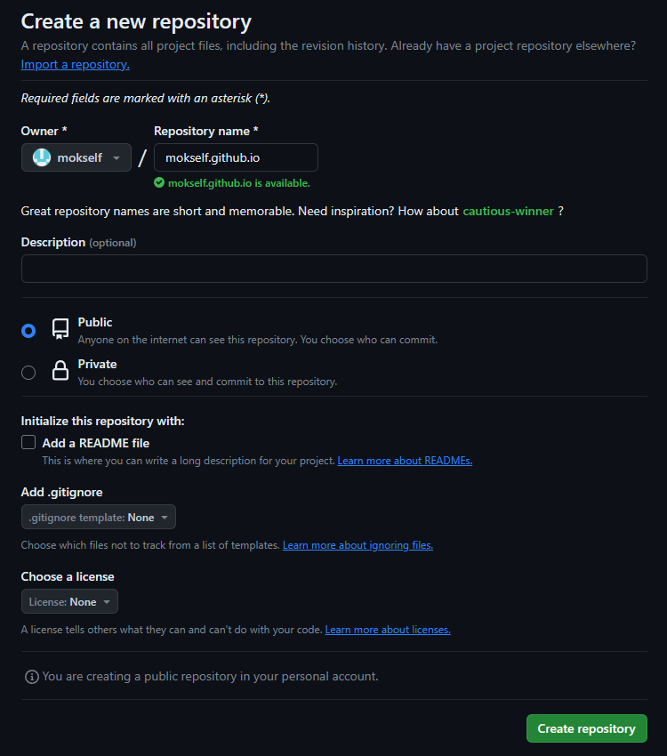
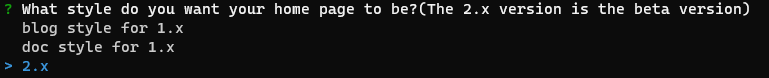

> 这篇博客就是用vuepress写的，所以这里写下第一篇文章就是vuepress的搭建教程

## 创建仓库
首先在github新建仓库[New repository](https://github.com/new)，取名为`<USERNAME>.github.io`这样你的访问路径就是`https://<USERNAME>.github.io`， 比如我的github用户名是`mokself`那么我的仓库地址就应该为`mokself.github.io`，如果取别的名称也可以，但是访问路径就变成`https://<USERNAME>.github.io/<REPO>`。 这个用户名可以在`Settings`里修改。其他的设置默认就好。


## 初始化项目
仓库建好后在本地搭建项目

由于这里用的是`vuepress`的一个主题`vuepress-theme-reco`，这个主题自带有CLI工具，所以直接使用这个CLI工具创建项目
[vuepress-theme-reco官网地址](https://vuepress-theme-reco.recoluan.com/)

在项目父目录执行初始化指令
```bash
npx @vuepress-reco/theme-cli init
```
::: details npx指令
执行npx命令需要node.js环境  
如果没有安装node无法使用npx，以及vuepress整个生态都是基于node.js  
node的官网地址[https://nodejs.org](https://nodejs.org)
:::

初始化过程中需要选择是否新建目录和新目录名称等，重要的是选择版本要选择**2.x**


等待初始化完成

## 运行项目
初始化后的项目还不能立即运行，需要先安装依赖
```bash
npm install
```
依赖安装完成后，可以在本地运行一下  
如果你的仓库名不是`<USERNAME>.github.io`，那么需要修改`.vuepress/config.ts`文件中的`base`属性，将其修改为`/<REPO>/`  
具体的配置参考[配置|VuePress](https://v2.vuepress.vuejs.org/zh/reference/config.html)
```bash
npm run dev
```
打开浏览器看看效果


正如我现在博客的风格

## 部署项目
本教程部署到github，如果想部署到其他敌方可以参考vuepress官方的文档[https://v2.vuepress.vuejs.org/zh/guide/deployment.html](https://v2.vuepress.vuejs.org/zh/guide/deployment.html)

使用Github本身的CI工具就可以实现自动化部署，即推送代码触发工作流执行脚本，刷新到Github Pages上

在项目根目录创建`.github/workflows/docs.yml`文件，文件内容如下：
::: details
```yaml
name: docs

on:
  # 每当 push 到 main 分支时触发部署
  push:
    branches: [main]
  # 手动触发部署
  workflow_dispatch:

# 设置 {{ GITHUB_TOKEN }} 的部署权限
permissions:
  contents: read
  pages: write
  id-token: write

jobs:
  docs:
    runs-on: ubuntu-latest

    steps:
      - uses: actions/checkout@v4
        with:
          # “最近更新时间” 等 git 日志相关信息，需要拉取全部提交记录
          fetch-depth: 0

      - name: Setup pnpm
        uses: pnpm/action-setup@v2
        with:
          # 选择要使用的 pnpm 版本
          version: 8
          # 使用 pnpm 安装依赖
          run_install: true

      - name: Setup Node.js
        uses: actions/setup-node@v4
        with:
          # 选择要使用的 node 版本
          node-version: 18
          # 缓存 pnpm 依赖
          cache: pnpm

      # 运行构建脚本
      - name: Build VuePress site
        run: pnpm build

      # 查看 workflow 的文档来获取更多信息
      # @see https://github.com/crazy-max/ghaction-github-pages
      - name: Deploy to GitHub Pages
        uses: crazy-max/ghaction-github-pages@v4
        with:
          # 部署到 gh-pages 分支
          target_branch: gh-pages
          # 部署目录为 VuePress 的默认输出目录
          build_dir: .vuepress/dist
        env:
          # @see https://docs.github.com/cn/actions/reference/authentication-in-a-workflow#about-the-github_token-secret
          GITHUB_TOKEN: ${{ secrets.GITHUB_TOKEN }}
```
:::

一切准备就绪后，推送代码到github，等待Github Action执行完毕。
```bash
# 初始化git仓库
git init
# 添加文件到git
git add .
# 提交到本地仓库
git commit -m "init"
# 创建main分支
git branch -M main
# 添加远程仓库 注意修改自己的仓库地址
git remote add origin https://github.com/<USERNAME>/<USERNAME>.github.io.git
# 推送到远程仓库
git push -u origin main
```

Action执行完毕后应该会多出一个`gh-pages`的代码分支，里面是build之后产生的静态文件，现在需要将这个分支设置为Github Pages的源分支  
在github仓库的`Settings`->`Pages`->`Branch`里选择`gh-pages`分支，folder选择`/(root)`，点击`Save`保存即可
::: tip
如果使用vuepress默认主题是应该选择`docs`文件夹的，但是使用`vuepress-theme-reco`主题后应该选择`/(root)`
:::

这个步骤可能会触发重新部署，等待部署完成后就可以访问了  
以后每一次提交到main分支都会触发Github Action重新部署，所以只需要推送代码就可以了

## 其他
### vuepress-theme-reco和VuePress的关系
[VuePress_2.x](https://v2.vuepress.vuejs.org/zh/) [vuepress-theme-reco](https://vuepress-theme-reco.recoluan.com/)

`vuepress-theme-reco`是`VuePress`的一个主题，文中的CLI工具安装隐藏里`VuePress`细节

在`.vuepress/config.ts`文件中可以配置一些细节，比如导航栏、侧边栏、友链等等，有的配置或特性`VuePress`是`vuepress-theme-reco`提供的，所以需要两个文档结合着看

`vuepress-theme-reco`还提供了一些原本没有的语法规则，例如自定义容器、代码组等等，具体的可以参考[Markdown扩展一栏](https://vuepress-theme-reco.recoluan.com/docs/theme/custom-container.html)

### 部署失败
每次部署失败都会收到一封邮件，可以点击跳转，也可以在  
Github仓库的菜单栏上找到`Actions`，里面可以看到工作流记录，如果部署失败可以点击进去查看具体的错误信息

错误提示`[vite]: Rollup failed to resolve import "vue" from ...`  
这是因为工作流配置(`.github/workflows/docs.yml`)中使用的pnpm进行构建，此时需要安装前置依赖  
在项目的`package.json`中添加
```json
"peerDependencies": {
    "vue": "3.3.13",
    "@vuepress/client": "^2.0.0-rc.0"
}
```
通过查看依赖树发现`vuepress-vite`的前置依赖是`"vue": "^3.3.4"`，但是这里我试了用`"vue": "^3.3.13"`也不会有问题

### Github Action
Github Action是Github提供的CI工具，可以在仓库的`.github/workflows`目录下创建工作流配置文件，当满足触发条件时执行工作流中的脚本  
本文用的就是Github Action进行自动化部署

Github Action的使用可以参考[官方文档](https://docs.github.com/zh/actions)

也有其他类似工具可以帮助部署 [travis-ci](https://www.travis-ci.com/)