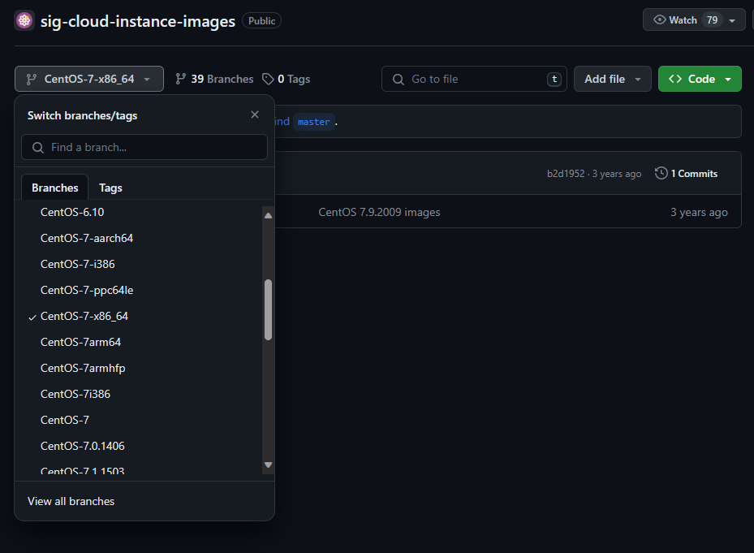
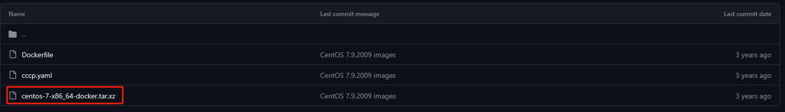

## 概述
WSL（Windows Subsystem for Linux）是Windows的一项功能，可用于在Windows中运行Linux环境而无需单独的虚拟机或双引导
> [WSL官方文档](https://docs.microsoft.com/zh-cn/windows/wsl)

## 下载系统
WSL支持的系统有Ubuntu、Debian、Kali等，这些系统可以直接在应用商店直接下载，本次要安装的系统是**CentOS**，CentOS不在应用商店中，需要手动下载  
[https://github.com/CentOS/sig-cloud-instance-images/](https://github.com/CentOS/sig-cloud-instance-images/)  
切换到对应版本分支

下载压缩包文件


## 安装系统
首先安装`Chocolatey`，`Chocolatey`是windows上的包管理工具  
然后使用`Chocolatey`安装`LxRunOffline`，`LxRunOffline`是wsl管理软件
```bash
# 安装 Chocolatey
Set-ExecutionPolicy Bypass -Scope Process -Force; iex ((New-Object System.Net.WebClient).DownloadString('https://chocolatey.org/install.ps1'))
# 安装 LxRunOffline
choco install lxrunoffline
```
安装完成后需要重启powershell，以进行下一步安装
```bash
LxRunOffline install -n 自定义系统名称 -d 安装目录路径 -f tar.xz安装包路径
# 注意windows系统命令行中的文件路径和linux系统差别很大
# 比如我这里的安装命令就是
LxRunOffline install -n centos -d D:/centos -f .\centos-7-x86_64-docker.tar.xz
# 将centos安装到D盘的centos文件夹下，并且命名为centos
```

## 3. 升级到wsl2
wsl2对比wsl1性能有很大提升，如果当前系统是wsl1，可以升级到wsl2
```bash
# 列出已经安装的wsl的信息
wsl -l -v
# 将对应的wsl设为wsl2，注意<Distro>要和上面查询到的信息一致
wsl --set-version <Distro> 2
# 设置默认使用的发行版
wsl -s <Distro>
```
官方文档[https://learn.microsoft.com/zh-cn/windows/wsl/install](https://learn.microsoft.com/zh-cn/windows/wsl/install)

## 4. 启动
```bash
LxRunOffline run -n 自定义系统名称
wsl -d 自定义系统名称
```

## 5. 其他
执行`systemct`l命令出现`wsl Failed to get D-Bus connection: Operation not permitted`
使用`vi`或`vim`命令编辑`/etc/wsl.conf`文件，插入以下内容
```bash
[boot]
systemd=true
```
然后需要重启linux子系统
```bash
wsl --shutdown
```